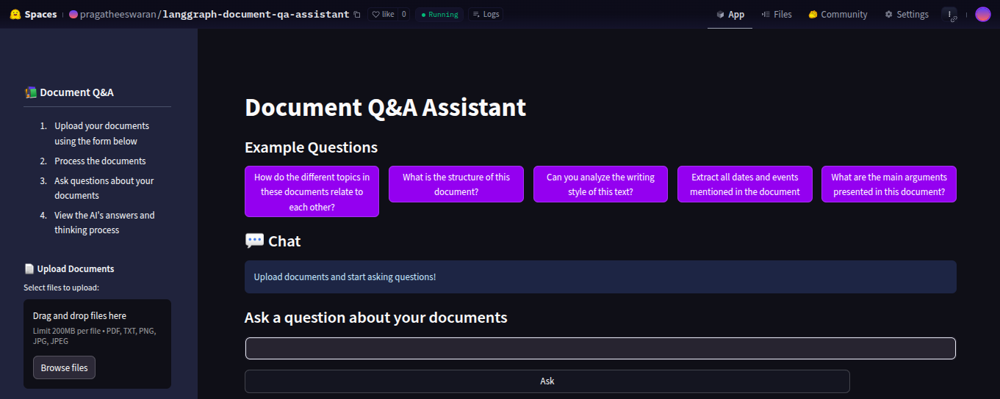
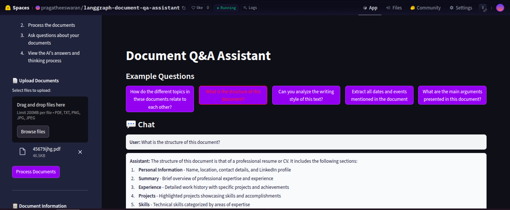

# 📚 Document Q&A Assistant

## Overview

Document Q&A Assistant is an advanced Streamlit application that allows users to upload and interactively query documents using state-of-the-art AI technologies. The app supports multiple document types (PDF, TXT, PNG, JPG) and provides an intelligent question-answering system with a step-by-step thinking process.

## 🌟 Features

- **Multi-Format Document Support**
  - Upload PDFs, text files, and images
  - Supports OCR for scanned documents and images
  - Process multiple files simultaneously

- **Intelligent Q&A System**
  - Uses advanced RAG (Retrieval-Augmented Generation) technique
  - Step-by-step thinking process for transparent reasoning
  - Contextual document understanding

- **User-Friendly Interface**
  - Intuitive sidebar for document management
  - Example questions to help users get started
  - Clear document processing and chat interface

## 🛠 Technologies Used

- **Frontend**: Streamlit
- **LLM**: DeepSeek-V3 (via Together API)
- **Vector Store**: FAISS
- **Embeddings**: Sentence Transformers
- **Text Processing**: 
  - PyTesseract (OCR)
  - PyPDF2
  - PDF2Image

## 📦 Prerequisites

- Python 3.8+
- pip or conda

## 🚀 Installation

1. Clone the repository:
```bash
git clone https://github.com/a-pragatheeswaran/langgraph-document-qa-assistant.git
cd document-qa-assistant
```

2. Create a virtual environment:
```bash
python -m venv venv
source venv/bin/activate  # On Windows, use `venv\Scripts\activate`
```

3. Install dependencies:
```bash
pip install -r requirements.txt
```

4. Install system dependencies:
```bash
sudo apt-get update
sudo apt-get install -y poppler-utils tesseract-ocr
```

5. Set up environment variables:
Create a `.env` file in the project root and add your API keys:
```
TOGETHER_API_KEY=your_together_api_key
```

## 🖥 Running the Application

```bash
streamlit run app.py
```

## 📸 Screenshots

### Screenshot 1: Document Upload


### Screenshot 2: Chat Interface


## 🛠 Project Link: [LangGraph Document QA Assistant](https://huggingface.co/spaces/pragatheeswaran/langgraph-document-qa-assistant)

## 🤝 Contributing

1. Fork the repository
2. Create your feature branch (`git checkout -b feature/AmazingFeature`)
3. Commit your changes (`git commit -m 'Add some AmazingFeature'`)
4. Push to the branch (`git push origin feature/AmazingFeature`)
5. Open a Pull Request

## 🔒 License

Distributed under the MIT License. See `LICENSE` for more information.

## 📞 Contact

**Your Name** - [apragatheeswaran1@gmail.com](mailto:apragatheeswaran1@gmail.com)


## 🙏 Acknowledgements

- [Streamlit](https://streamlit.io/)
- [LangChain](https://www.langchain.com/)
- [Together AI](https://www.together.ai/)
- [Hugging Face](https://huggingface.co/)

## 📋 Requirements File (requirements.txt)

```txt
streamlit==1.29.0
langchain==0.1.0
together==0.2.0
PyPDF2==3.0.1
pdf2image==1.16.3
pytesseract==0.3.9
Pillow==9.5.0
python-dotenv==1.0.0
faiss-cpu==1.7.4
sentence-transformers==2.2.2
langgraph==0.1.0
```

## 🖼 Creating Screenshots Folder

To help future contributors and users understand your project, create a `screenshots` directory in your project root and add some representative screenshots:

1. Take screenshots of:
   - Document upload interface
   - Chat interface with a processed document
   - Example queries and responses

2. Name them descriptively:
   - `document-upload.png`
   - `chat-interface.png`

3. Optimize images for web (compress without losing quality)

## 📝 Notes for Contributors

- Ensure all dependencies are up to date
- Follow PEP 8 style guidelines
- Add type hints and docstrings
- Write unit tests for new features
